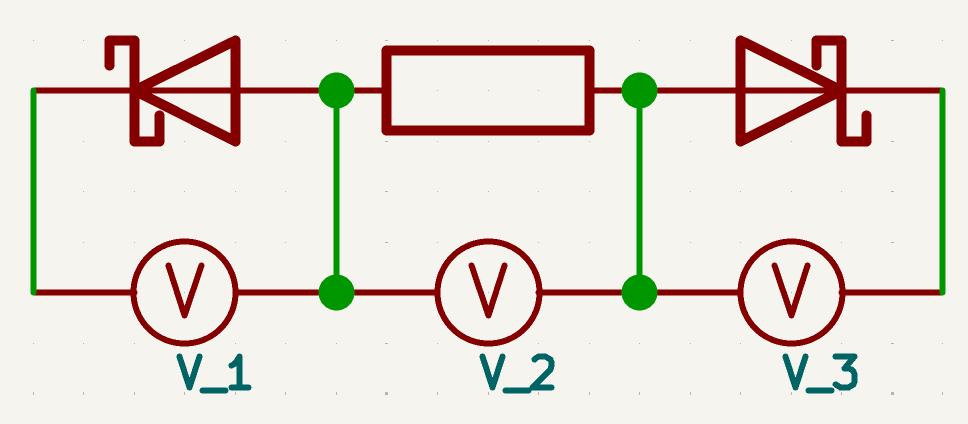
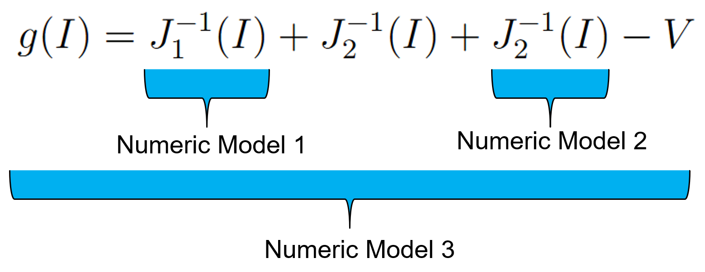
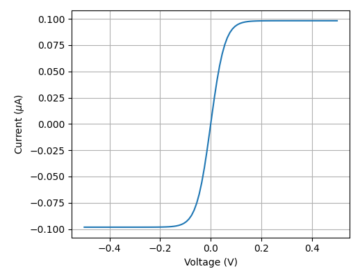
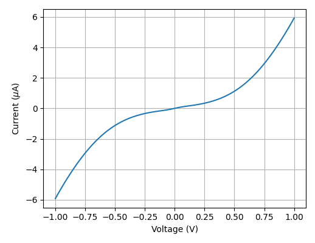
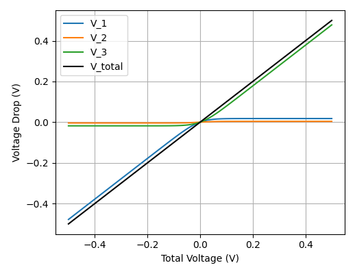
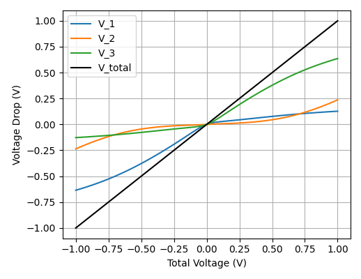

# Back-to-Back Schottky Diode Numeric Model

This repository provides a numerical model for a metal–semiconductor–metal (MSM) structure, represented as two back-to-back Schottky diodes separated by an ohmic series resistance. The Schottky diodes are modeled using thermionic emission theory and barrier hight lowering.

## Model Overview

An MSM contact is modeled using the equivalent circuit below:

The total applied voltage is the sum of the voltage drops across the two Schottky diodes and the semiconductor:

$$
V = V_1 + V_2 + V_3
$$

To obtain the current $J$ for a given voltage $V$, we rewrite the equation using the inverse current–voltage characteristics:

$$
V = \sum_n J_n^{-1}(J)
$$

Since this equation cannot be solved analytically, we solve the root-finding problem:

$$
g(J) = \sum_n J_n^{-1}(J) - V = 0
$$

The function $g(J)$ is strictly monotonic and $\lim_{J \to \pm \infty} \frac{dg(J)}{dJ} = 0$, enabling a robust bisection-based solution.

## Schottky Diode
At room temperature in moderately doped semiconductors, the dominant transport mechanism is thermionic emission
$$
J_n = \left[ A^\ast T^2 exp(-\frac{q\Phi_{Bn}}{k_B T}) \right] \left[exp(\frac{qV}{k_B T}) - 1 \right]
$$
where $T$ is the Temperature, $k_B$ is the Bolzmann constant $V$ is the bias voltage across the Schotky diode and $A^\ast = \frac{4\pi q m^\ast k_B^2}{h^3}$ is the Richardson constant with $m^\ast$ the effective carrier mass and $h$ the Planck constant.

## Non-Ideal Schottky Behavior
Real Schottky contacts deviate from ideal thermionic emission behavior. The barrier height of a Schottky diode is affected by the applied bias due to image‐force barrier lowering. To account for these non-ideal effects, the ideality factor $n$ is introduced, and the ideal barrier height is replaced by the **effective barrier height**:

$$
\Phi_B = \Phi_{B0} + V \left(\frac{1}{n} - 1\right)
$$

The characteristic curve $J(V)$ that incorporates the effective barrier height is no longer analytically invertible. Consequently, a secondary bisection algorithm is employed to numerically determine the inverse relation.

To compute the full current–voltage characteristic of the back-to-back Schottky diode system, a nested bisection algorithm is implemented:

This nested approach ensures numerical stability provided that the bracketing intervals, tolerances, and termination criteria are chosen with appropriate care.

## Example Solutions

| Ideal Schottky Diodes | Non-Ideal Schottky Diodes (Barrier Lowered) |
|-----------------------------|-----------------------------|
|  |  |
|  |  |

Parameters:  
- Barrier height: $ \Phi_{B0} = 0.2 \,\mathrm{eV} $ 
- Contact area: $ A = 0.09\,\mu\mathrm{m}^2 $ 
- Series resistance: $ R = 40\,\mathrm{k\Omega} $ 
- Temperature: $ T = 300\,\mathrm{K} $ 
- Non-ideal case adds an ideality factor $ n = 1.2 $

